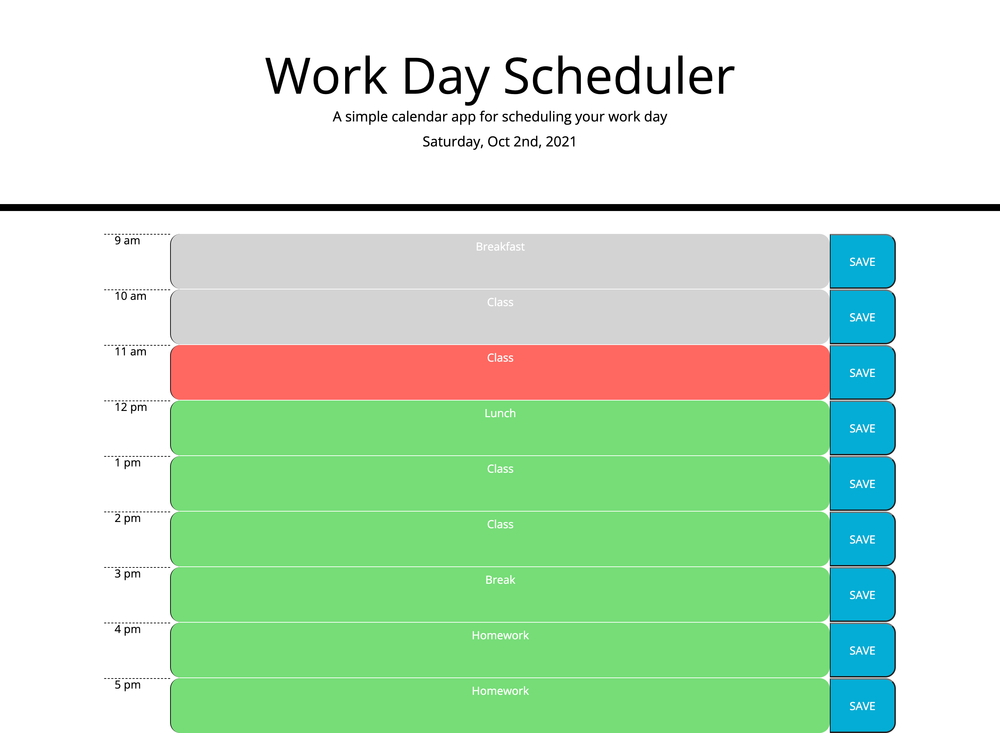

# HW5---Day-Planner
## Assignment Intro
In this assignment, we were given the task to create a daily scheduler. The functions of the daily scheduler include the colors of each line changing as the hours pass and the option to save your text into local storage. This assignment included a lot of new things to learn such as using Bootstrap to easily create HTML templates, jquery in Javascript, momentjs for time, and the use of the browser's local storage to save small amounts of data.

## Technologies used
* HTML
* CSS
* Javascript
* Jquery
* Bootstrap

## Webpage

## Link to webpage
**[Day Planner](https://sitmeister.github.io/HW5---Day-Planner/)**